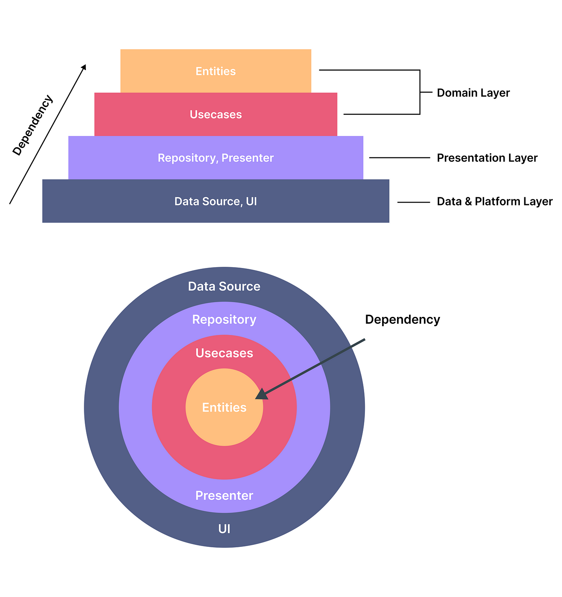

# Clean Architecture Flutter Counter App with Provider

This repository serves as a demonstration of implementing Clean Architecture principles in a Flutter application, focusing on a simple counter feature. The architecture is designed for maintainability, testability, and scalability, with state management handled using the `Provider` package.

## Project Structure

### `lib` Folder

#### `config` Folder

- **`themes` Folder:** Contains theme configurations for the application.
  - `dark_theme.dart`: Dark theme configuration.
  - `light_theme.dart`: Light theme configuration.

#### `features` Folder

- **`counter` Folder:**
  - **`data` Folder:**
    - **`datasources` Folder:** Data sources for fetching data.
      - `counter_datasource.dart`: Data source for the counter feature.
    - **`models` Folder:** Data models representing the app's data.
      - `counter_model.dart`: Model for the counter feature.
    - **`repositories` Folder:** Repository implementation.
      - `counter_repository_impl.dart`: Implementation of the counter repository.
  - **`domain` Folder:**
    - **`entities` Folder:** Core business logic entities.
      - `counter_entity.dart`: Entity for the counter feature.
    - **`repositories` Folder:** Abstract repositories defining contracts for data access.
      - `counter_repository.dart`: Abstract counter repository.
    - **`usecases` Folder:** Use case classes orchestrating the flow of data.
      - `get_counter_usecase.dart`: Use case for getting the counter.
  - **`presentation` Folder:**
    - **`pages` Folder:** Presentation layer pages.
      - `counter_page.dart`: Counter page widget.
    - **`providers` Folder:** State management using the `Provider` package.
      - `counter_provider.dart`: Provider managing app state for the counter feature.
    - **`widgets` Folder:** UI components.
      - `actions_widget.dart`: Widget for counter actions.
      - `counter_widget.dart`: Widget for displaying the counter value.
